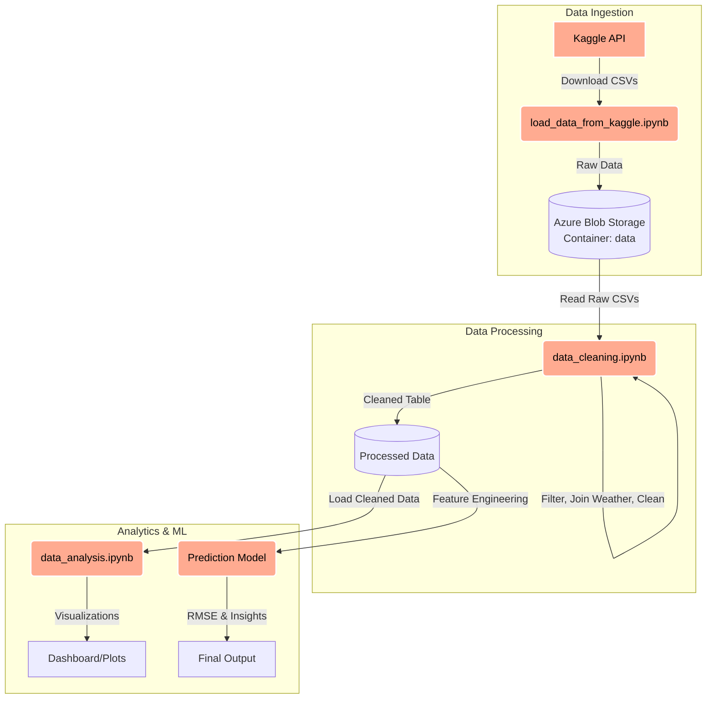
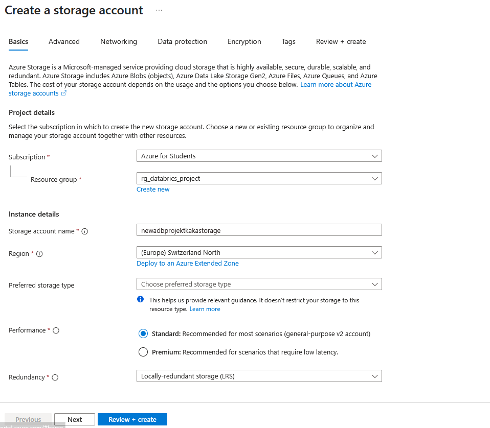
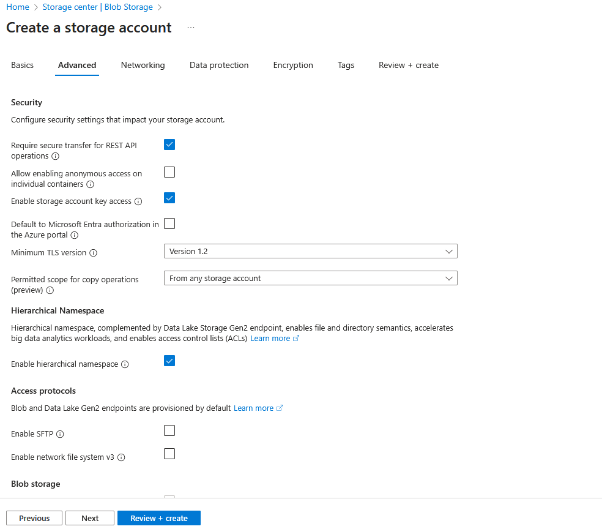
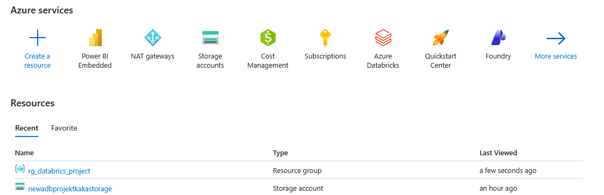
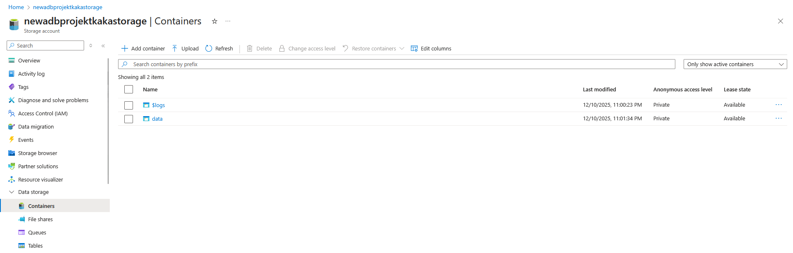
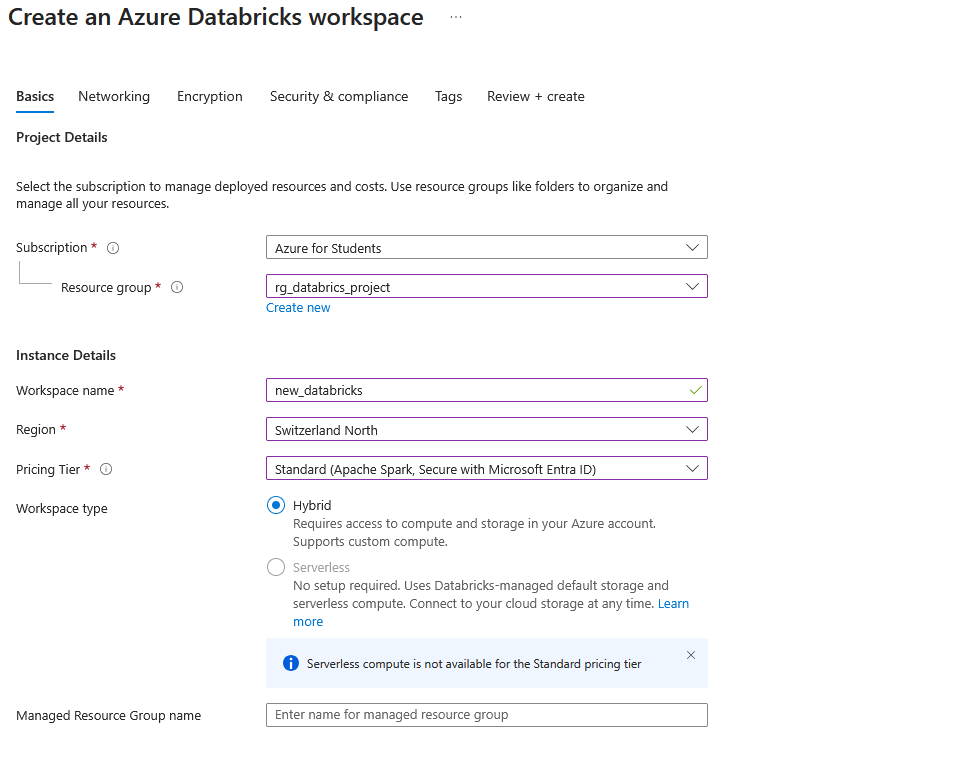
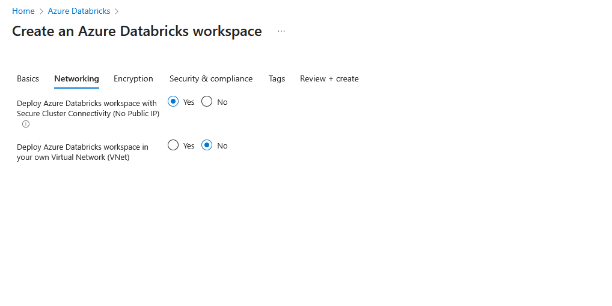
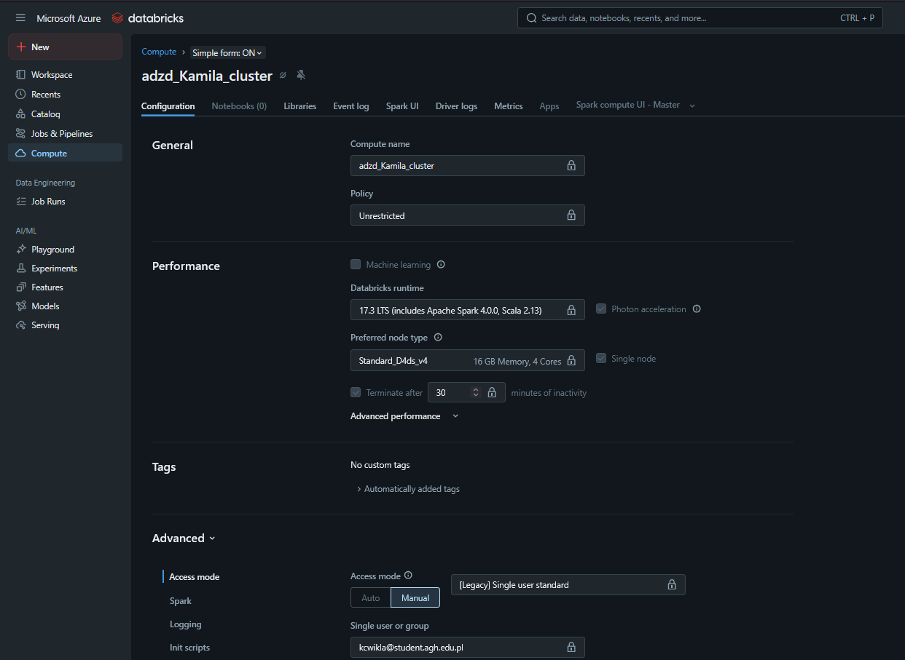

<div align="center">

# Databricks Flight Lakehouse
### Data Processing with Azure Databricks

**Authors:** Klaudia Stodółkiewicz & Kamila Ćwikła


</div>

---

## Table of Contents
* [Project Goal](#project-goal)
* [Data](#data)
* [Repository Structure](#repository-structure)
* [Pipeline](#pipeline)
* [Environment Setup in Azure](#environment-setup-in-azure)
* [Prediction](#prediction)
<!-- * [Summary](#summary) -->
* [Links](#links)

---
## Project Goal

The goal of this project is to build and showcase a data processing pipeline using **Azure Databricks**. The project showcases the entire data lifecycle - from ingestion from selected sources, through cleansing and preprocessing, to preparing the data for analytics and machine learning models.

## Data

Analysis is based on the [2015 Flight Delays and Cancellations](https://www.kaggle.com/datasets/usdot/flight-delays) dataset. The data is stored in CSV format and comprises three relational tables: `flights`, `airports`, and `airlines`. With the primary table containing over **5.8 million records**, the dataset is reasonable for demonstrating distributed processing using Apache Spark.

Additionally, the project incorporates the [NOAA JFK](https://www.kaggle.com/datasets/mexwell/noaa-weather-data-jfk-airport?select=jfk_weather.csv) dataset, which contains hourly weather observations from JFK Airport. The attributes include temperature, wind speed, humidity, visibility, and atmospheric pressure. By extracting data specifically for the year 2015, we can integrate it with the flight records from the same period. This allows for an **in-depth analysis** of how specific weather conditions impact flight delays at JFK Airport.

## Repository Structure

```text
.
├── .databricks/                      # Databricks environment configuration
├── images/                           # Screenshots and diagrams used in the README
├── data_analysis.ipynb               # Exploratory Data Analysis (EDA), visualizations, and insights
├── data_cleaning.ipynb               # Data preprocessing, cleaning, and joining with weather data
├── load_data_from_kaggle.ipynb       # Script to fetch data from Kaggle API to Azure Storage
├── read_data_from_raw_test.ipynb     # Verification of raw data ingestion
├── prediction_models.ipynb           # ML experiments on cleaned data (classification & regression)
├── prediction_models_outliers.ipynb  # ML experiments with outliers
└── README.md                         # Main project documentation
```

## Pipeline

The project follows a modern Lakehouse architecture pattern. Below is the workflow overview:


 **Pipeline Workflow:**
> 1. **Ingestion:** Data is fetched directly from Kaggle (Flights & Weather datasets) using the Kaggle API and stored in Azure Blob Storage.
> 2. **Processing:** The `data_cleaning` notebook handles missing values, converts timestamps, filters outliers, and joins flight data with hourly weather conditions from JFK.
> 3. **Analytics:** The cleaned dataset is used in `data_analysis` to generate insights on delays.
> 4. **Modeling:** Finally, machine learning models (RandomForest/GBT) are applied to predict delay durations based on weather and flight parameters.

## Environment Setup in Azure

First, an [Azure account](https://portal.azure.com/) was created. This project utilizes the **Azure for Students** subscription, which provides $100 in credits to explore and deploy cloud resources.

### 1. Storage Setup

**Step:** `Create resource` > `Storage account`

The `Storage Account`, named `newadbprojektkakastorage`, is responsible for the secure storage of data and its accessibility to other Azure services, such as Databricks. During the setup, a new **Resource Group** named `rg_databrics_project` was created to serve as a logical container for all project-related resources.

<div align="center">
  <br><br>
  
</div>

After completing these steps, the **Resources** tab in Azure appears as follows:

<div align="center">
  
</div>

**Step:** `Storage account` > `Data storage` > `Container`

Creating a data container named `data`:

<div align="center">
  
</div>

### 2. Databricks Workspace

**Step:** `Azure Databricks` > `Create`

Creating a Databricks workspace named `new_databricks`.

<div align="center">
  
</div>

It is important to ensure the following settings are applied in the **Networking** tab (avoiding a public IP helps to prevent unnecessary costs):

<div align="center">
  
</div>

Once created, click **Launch Workspace** to open the Databricks environment.

### 3. Cluster Configuration

**Step:** `Databricks` > `New` > `Cluster`

<div align="center">
  
</div>

Next, we used the Kaggle API to download the datasets into the data container via the `load_data_from_kaggle.ipynb` notebook. The project workflow was also synchronized with GitHub using Databricks Repos for version control.


## Prediction

The project involves predicting flight delays using both classification (to determine if a delay will occur) and regression (to estimate the exact delay duration in minutes). For the regression models, tests were conducted using both raw data and log-transformed target variables (log1p). Additionally, the analysis compared model performance across two scenarios: using the complete dataset and a cleaned dataset with outliers removed. This approach allowed for a comprehensive evaluation of how extreme delay values impact model stability and predictive accuracy.

Sadly, the classification and regression models do not demonstrate significant predictive power. In the classification task, an AUC of around 0.51 indicates performance no better than random guessing; the high accuracy observed is a result of a highly imbalanced dataset dominated by on-time flights. In the regression task, an R2 close to zero suggests that the available features are insufficient to predict delay duration in minutes. The most influential features were DISTANCE and HOURLYWindSpeed, while the impact of airlines was minimal. Overall, the current dataset does not provide enough signal for reliable flight delay prediction.

(wyniki bez outlierów opisac jesli sie uda uzyakc inne)

<!-- ## Summary -->


## Links

* [Azure Databricks Documentation](https://learn.microsoft.com/en-us/azure/databricks/)
* [Databricks Repos - GitHub Integration](https://www.youtube.com/watch?v=Fnb4sA0hG8U)
* [How to make outputs visible on GitHub](https://learn.microsoft.com/en-us/azure/databricks/notebooks/notebook-format)
